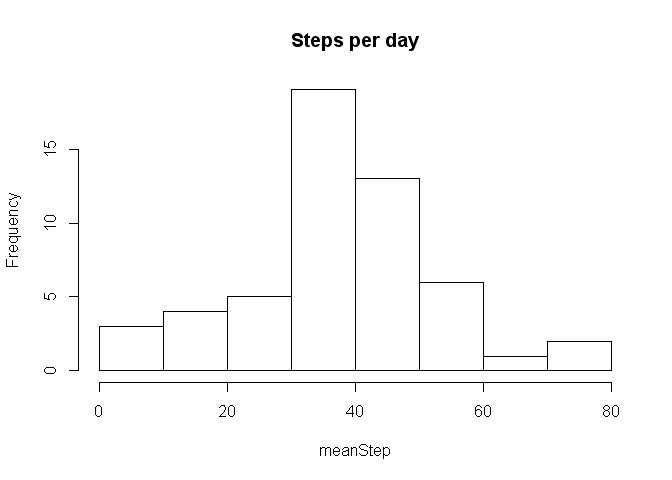
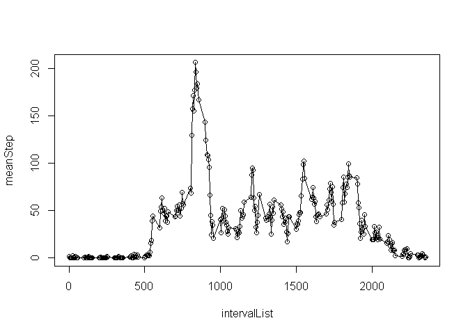
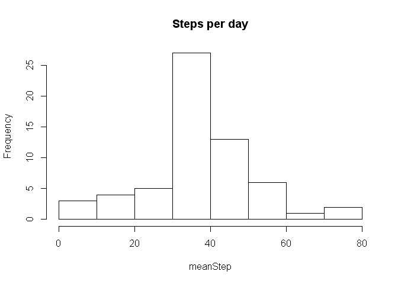
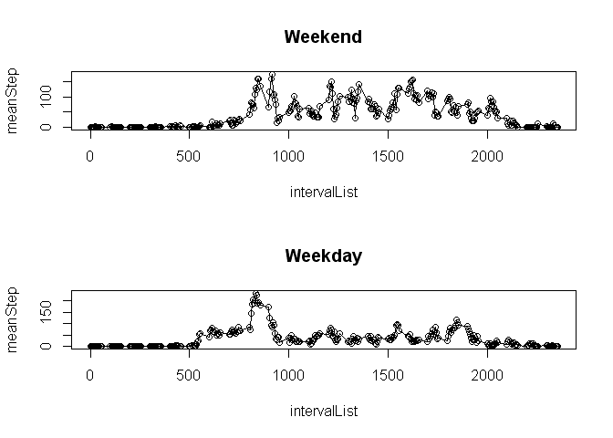

# Reproducible Research: Peer Assessment 1


## Loading and preprocessing the data


```r
activity <- read.csv("activity.csv")
activity_na <- na.omit(activity)
```


## What is mean total number of steps taken per day?


```r
dateList <- unique(activity_na$date)
meanStep <- sapply(dateList, function(x) mean(activity_na[activity_na$date==x,]$steps, na.rm=TRUE))
hist(meanStep, main="Steps per day")
```

 

```r
mean(meanStep)
```

```
## [1] 37.3826
```

```r
dateList[which.max(meanStep)]
```

```
## [1] 2012-11-23
## 61 Levels: 2012-10-01 2012-10-02 2012-10-03 2012-10-04 ... 2012-11-30
```


## What is the average daily activity pattern?


```r
intervalList <- unique(activity_na$interval)
meanStep <- sapply(intervalList, function(x) mean(activity_na[activity_na$interval==x,]$steps, na.rm=TRUE))
par(mfrow=c(1,1))
plot(intervalList, meanStep)
lines(intervalList, meanStep)
```

 

```r
df <- data.frame(intervalList, meanStep)
df[df$meanStep==max(df$meanStep),]$intervalList
```

```
## [1] 835
```

## Imputing missing values

For missing values, they are simply replaced with the mean of all steps across all days and intervals


```r
nrow(activity) - nrow(activity_na)
```

```
## [1] 2304
```

```r
activity_impute <- activity
activity_impute[is.na(activity_impute$steps),]$steps = mean(activity_na$steps)

dateList <- unique(activity_impute$date)
meanStep <- sapply(dateList, function(x) mean(activity_impute[activity_impute$date==x,]$steps, na.rm=TRUE))
hist(meanStep, main="Steps per day")
```

 

```r
mean(meanStep)
```

```
## [1] 37.3826
```

```r
dateList[which.max(meanStep)]
```

```
## [1] 2012-11-23
## 61 Levels: 2012-10-01 2012-10-02 2012-10-03 2012-10-04 ... 2012-11-30
```

## Are there differences in activity patterns between weekdays and weekends?


```r
activity_na$weekday <- weekdays(as.Date(activity_na$date))
activity_na$is_weekend <- activity_na$weekday == "Saturday" | activity_na$weekday == "Sunday"

par(mfrow=c(2,1))
activity_weekend <- activity_na[activity_na$is_weekend,]
intervalList <- unique(activity_weekend$interval)
meanStep <- sapply(intervalList, function(x) mean(activity_weekend[activity_weekend$interval==x,]$steps))
plot(intervalList, meanStep, main="Weekend")
lines(intervalList, meanStep)


activity_weekday <- activity_na[!activity_na$is_weekend,]
intervalList <- unique(activity_weekday$interval)
meanStep <- sapply(intervalList, function(x) mean(activity_weekday[activity_weekday$interval==x,]$steps))
plot(intervalList, meanStep, main="Weekday")
lines(intervalList, meanStep)
```

 


